# AURA Companion Robot

AURA is a desktop companion robot built around an ESP32-S3 and a laptop-based
Python brain. The ESP32 drives the ILI9341 face display, ES8311 microphone and
speaker, touch input, head servo and other peripherals. The laptop runs wake-word
detection, speech recognition, language-model responses, vision, reminders,
weather, web search, music control and face following. The two sides communicate
over USB serial.

## Repository contents

- `software/` contains the current working Python application, tests, local model
  files and launch scripts.
- `firmware/AURA_Firmware/` contains the current Arduino ESP32-S3 firmware.
- `docs/ROBOT_TEST_REPORT.md` records the latest prototype audit and its limits.

The repository does not contain API credentials, saved face templates, recordings,
runtime logs or previous firmware backups. The included `aura_settings.json` is a
safe example configuration. Set your own serial port and optional service settings
locally before running AURA.

## Project gallery

These images show the assembled prototype, its expressions, timer display, internal
hardware, CAD work and live software demonstrations.

### Physical prototype

<p align="center">
  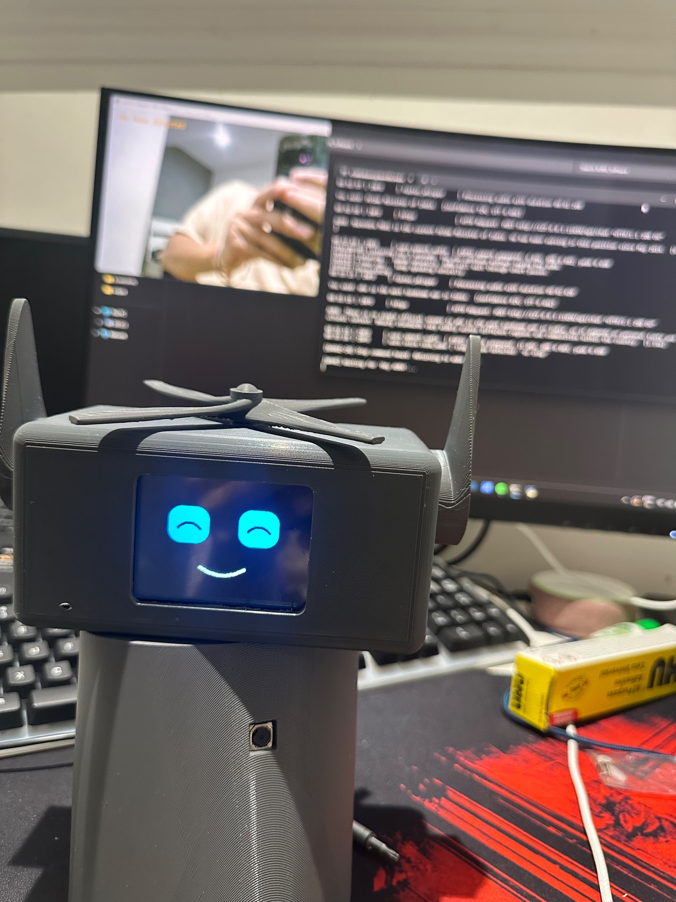
  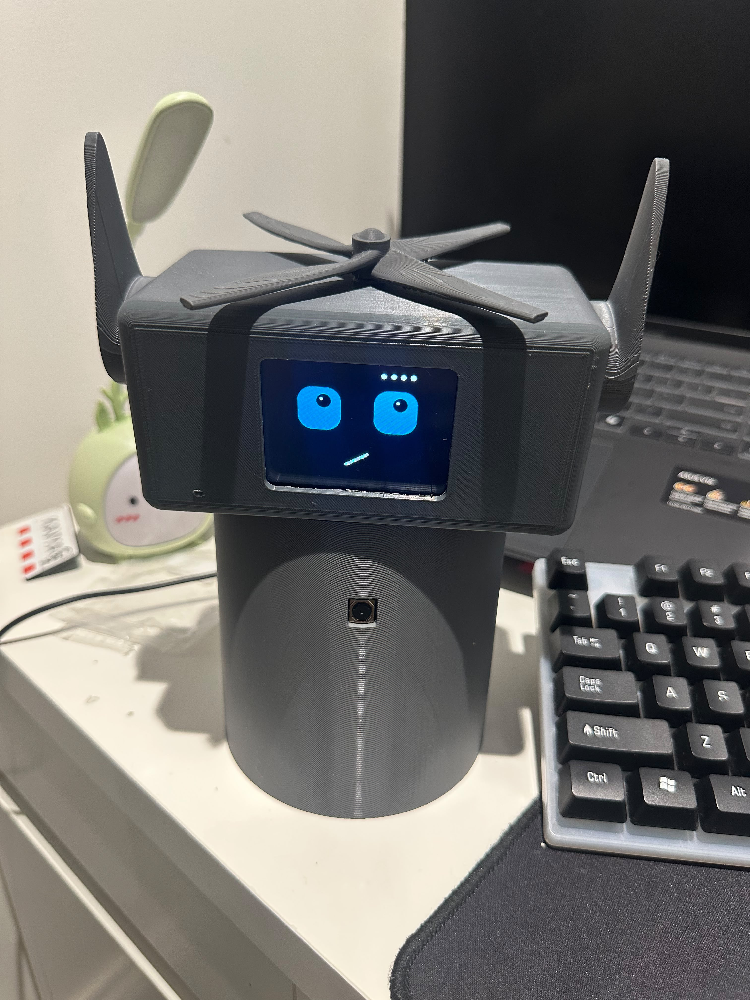
  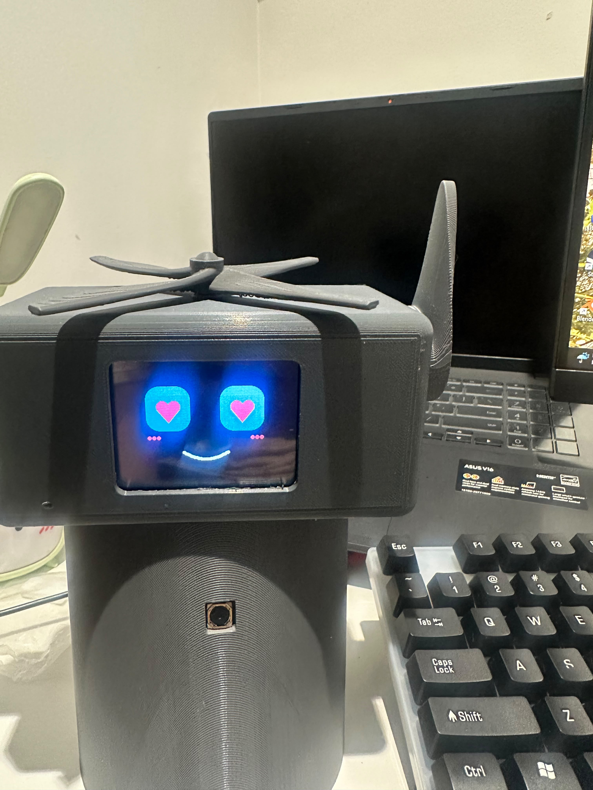
</p>
<p align="center">
  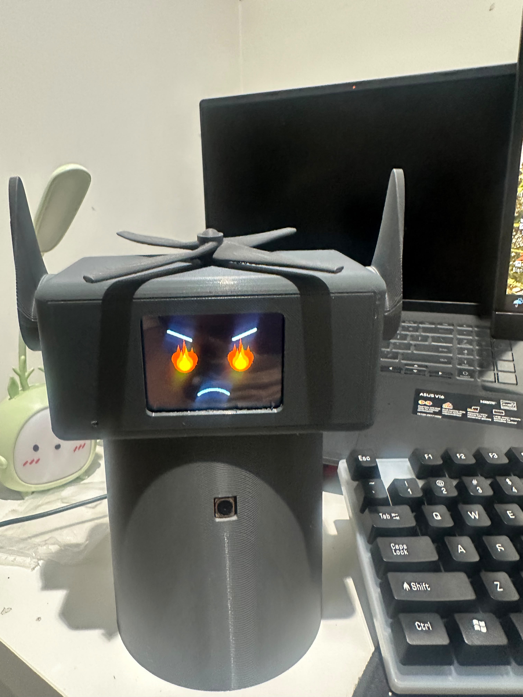
  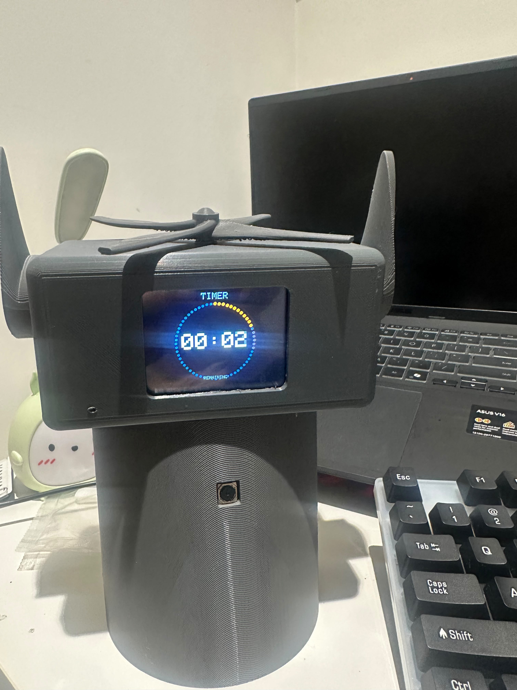
  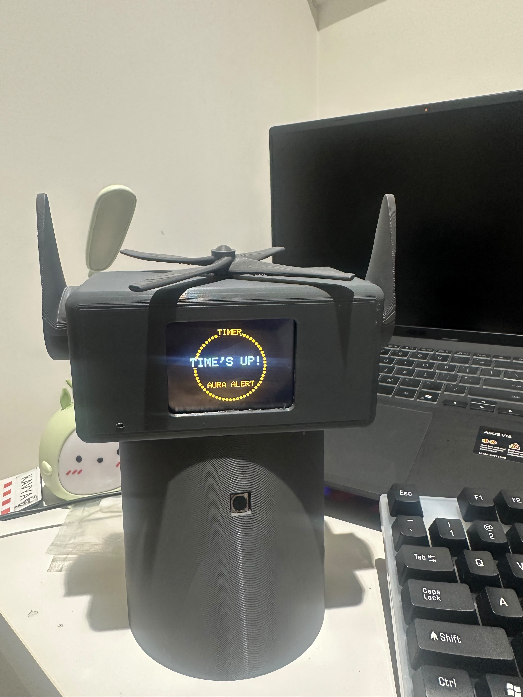
</p>

### Design and implementation

<p align="center">
  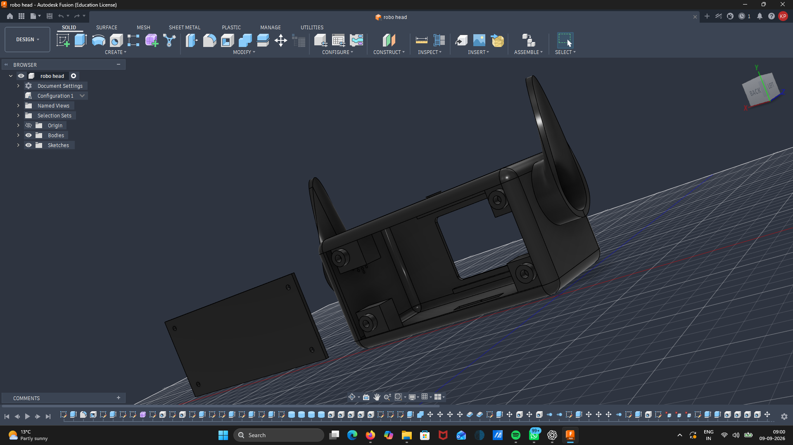
  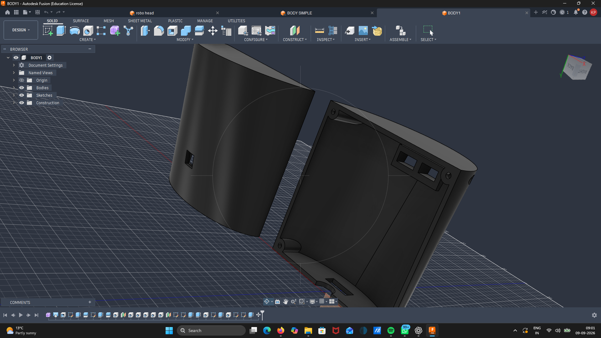
</p>
<p align="center">
  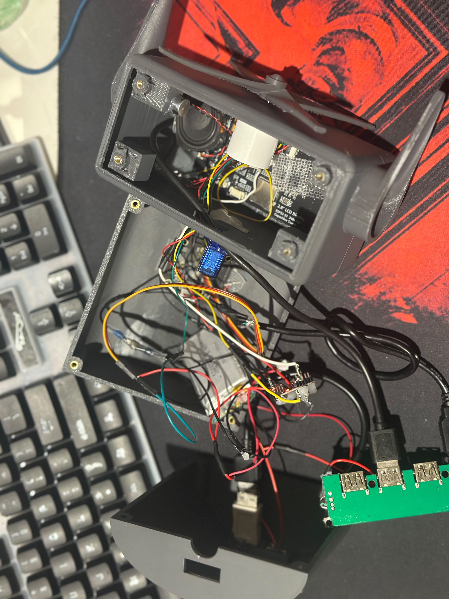
  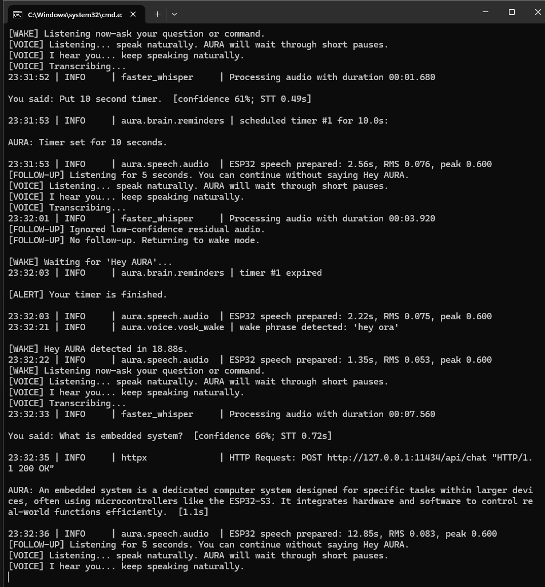
</p>

### Feature demonstration

<p align="center">
  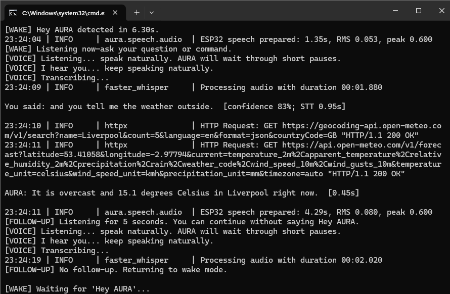
</p>

## Laptop setup

From the repository folder:

```powershell
python -m pip install -r software/requirements_brain.txt
```

Install and start [Ollama](https://ollama.com/), then make the local model
available:

```powershell
ollama pull qwen3.5:4b
```

Edit `software/aura_settings.json` if your board uses a different COM port. The
default configuration expects the bundled Vosk and OpenCV models under
`software/models/` and uses the ESP32 audio path.

Start the brain with `START_AURA.bat`, or run:

```powershell
cd software
python run_aura_brain.py
```

Close Arduino Serial Monitor before starting the Python brain because only one
program can own the USB serial port. Useful commands include `/audio`,
`/speaker-test`, `/listen`, `/calibrate`, `/conversation`, `/volume 70`,
`/enroll YourName`, `/faces`, `/timers` and `/quit`.

## Firmware setup

Open `firmware/AURA_Firmware/AURA_Firmware.ino` in Arduino IDE. Select an
ESP32-S3 board, enable USB CDC on boot, use 16 MB flash and upload at 921600 baud.
Install the libraries listed in `firmware/README.md`, then upload the sketch.

The firmware source is the updated working build used by the prototype. Compiled
build artifacts are intentionally not published.

## Evidence and limitations

The prototype audit separates automated checks, physical observations and small
timing samples. It does not claim general speech accuracy, Google-Lens-level
object identification, long-term reliability or measured electrical power use.
See `docs/ROBOT_TEST_REPORT.md` for the full scope.

## License

MIT License. Copyright (c) 2026 Kavya Panu.
